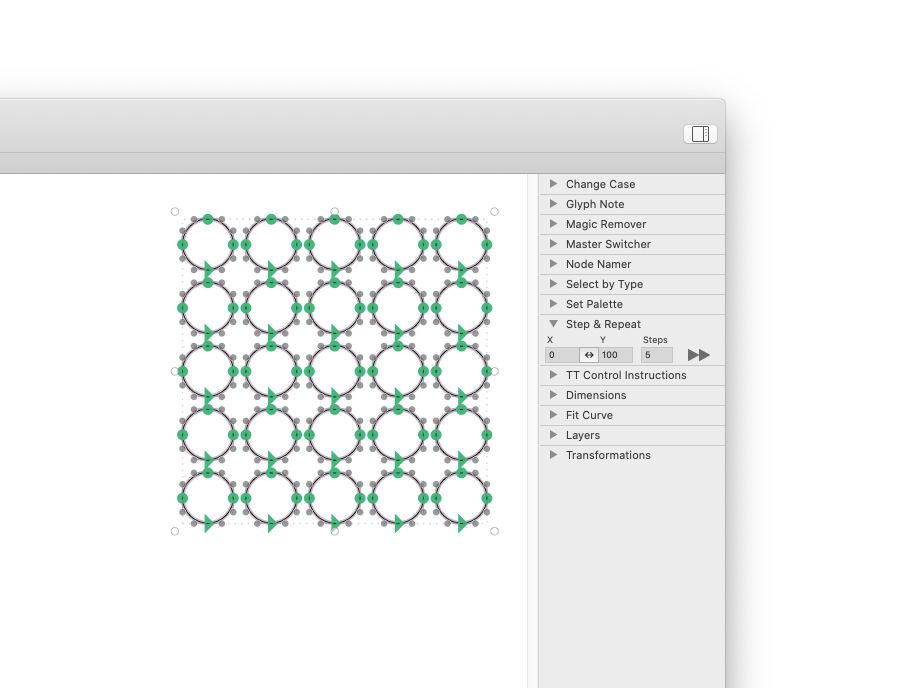

# Step and Repeat

 Palette plug-in for the Glyphs.app font editor. Allows shift-repeating shapes.

*After installation, Step and Repeat will appear in the app palette on the right side (Cmd-Opt-P).*

### Usage

1. Select one or more objects.
2. Type (or step with arrows, Shift-arrows, or Cmd-Shift-arrows) an *X* shift, a *Y* shift.
3. Type (or step with arrows, Shift-arrows, or Cmd-Shift-arrows) a *Steps* number, including the original. Minimum: 2.
4. Press the *Go* button.

The newly created objects will be added to the selection for making further transformations possible.

### Example

You have a circle with a radius of 80 units, and you want a grid of 5×5 circles with 20 units between adjacent circles.

1. Select the circle by double clicking one of its segments with the Select tool (shortcut V).
2. Type *X* 100, *Y* 0, *Steps* 5, and press *Go.*
3. Type *X* 0, *Y* 100, *Steps* 5, and press *Go.*

### Installation

1. Open *Window > Plugin Manager*
2. Find *Step and Repeat* and click the *Install* button
3. Restart Glyphs.app

### License

Copyright 2020 Rainer Erich Scheichelbauer (@mekkablue).
Based on sample code by Georg Seifert (@schriftgestalt) and Jan Gerner (@yanone).

Licensed under the Apache License, Version 2.0 (the "License");
you may not use this file except in compliance with the License.
You may obtain a copy of the License at

http://www.apache.org/licenses/LICENSE-2.0

See the License file included in this repository for further details.
